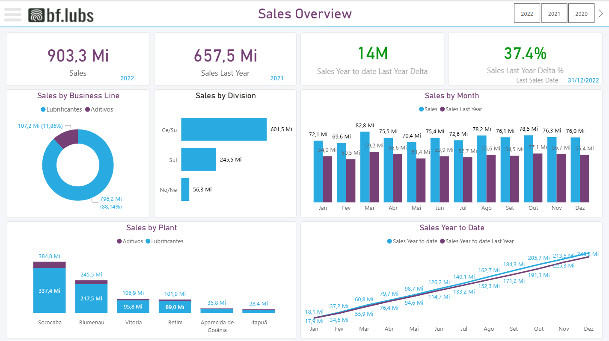

# 📊 Power BI - Sales Overview Dashboard (BF.Lubs)



[🔗 **Acessar Dashboard Publicado no Power BI**](https://app.powerbi.com/links/ncAn-Syu1Y?ctid=ba201131-9621-49ca-b50d-57d968b4ac35&pbi_source=linkShare&bookmarkGuid=cfe745d3-1de5-4b23-8648-a082f7c032d6)

---

## ⬇️ Download rápido

> Pré-requisito para abrir o arquivo: [**Power BI Desktop**](https://powerbi.microsoft.com/desktop/) (gratuito, Windows).

### Opção 1 — Só o dashboard `.pbix` (~28 MB) — **recomendado**

👉 [**Baixar bf_lubs_sales.pbix**](https://github.com/brendongarcia/powerbi-sales-dashboard-bflubs/raw/main/bf_lubs_sales.pbix)

O `.pbix` já contém os dados carregados. Basta baixar e abrir — não precisa da pasta `data/`.

### Opção 2 — Projeto completo `.zip` (~125 MB)

👉 [**Baixar ZIP do repositório**](https://github.com/brendongarcia/powerbi-sales-dashboard-bflubs/archive/refs/heads/main.zip)

Inclui o `.pbix` **+** a base de dados bruta (CSVs mensais, XLSX, TXT) para refazer o ETL do zero.
Alternativa pela interface: botão verde **`<> Code`** → **`Download ZIP`**.

### Opção 3 — Git

```bash
git clone https://github.com/brendongarcia/powerbi-sales-dashboard-bflubs.git
```

Só o dashboard, pulando os ~95 MB de dados brutos:

```bash
git clone --filter=blob:none --sparse https://github.com/brendongarcia/powerbi-sales-dashboard-bflubs.git
cd powerbi-sales-dashboard-bflubs
git sparse-checkout set --no-cone bf_lubs_sales.pbix
```

### Depois de abrir

1. Abra `bf_lubs_sales.pbix` no Power BI Desktop.
2. Explore os filtros interativos (ano, divisão, planta).
3. Se for atualizar os dados: **Transformar dados → Configurações da fonte de dados** e aponte para a pasta `data/` local.

---

## 🧠 Sobre o projeto

Este projeto apresenta um **Dashboard de Vendas desenvolvido no Power BI**, com foco em **análise de desempenho anual**, **comparativos históricos** e **segmentação por área de negócio**.

O painel foi criado para a empresa fictícia **BF.Lubs**, com o objetivo de **monitorar vendas, comparar resultados com o ano anterior e identificar oportunidades de crescimento**.

Além das análises visuais, o projeto se destaca pelo uso de **medidas DAX avançadas**, que permitem comparativos dinâmicos entre períodos e cálculos acumulados (YTD), otimizando a tomada de decisão gerencial.

---

## 📁 Estrutura do repositório

```
├── bf_lubs_sales.pbix     # dashboard (abra este arquivo)  ~28 MB
├── data/                  # base de dados bruta            ~95 MB
│   ├── Sales/             # 48 CSVs mensais (2019–2022)
│   ├── 2022 Sales.xlsx
│   ├── deliveries.csv
│   ├── tbl_Customer.xlsx
│   ├── tbl_Location.xlsx
│   ├── tbl_Material.xlsx
│   └── tbl_Plant.txt
└── images/
    └── dashboard_preview.png
```

---

## ⚙️ Funcionalidades

✅ **Indicadores principais:**
- **Total de Vendas**
- **Vendas do Último Ano**
- **Variação Anual**
- **Delta Absoluto**

✅ **Análises interativas:**
- *Sales by Business Line:* comparação entre Lubrificantes e Aditivos
- *Sales by Division:* desempenho das divisões regionais
- *Sales by Plant:* análise de produção por planta industrial
- *Sales by Month:* comparativo mês a mês entre anos
- *Sales Year to Date:* acompanhamento acumulado das vendas

---

## 🧩 Medidas DAX utilizadas

As medidas foram criadas em **DAX** para permitir **comparações automáticas entre períodos**, **cálculos acumulados (YTD)** e **percentuais de crescimento**, utilizando funções como `CALCULATE`, `VAR`, `SAMEPERIODLASTYEAR`, `FILTER` e `TOTALYTD`.

### 🔹 Total de Vendas
```DAX
Sales = SUM(
     fat_sales[Revenue]
)
```

### 🔹 Vendas Ano Anterior (comparativo dinâmico)
```DAX
Sales Last Year = 
    VAR YoY =
    CALCULATE(
        [Sales],
        SAMEPERIODLASTYEAR(dim_calendario[Date])
    )
RETURN
    IF(
        [Sales],
        YoY
    )
```

### 🔹 Vendas Acumuladas (Year to Date)
```DAX
Sales Year to date = 
TOTALYTD(
    [Sales],
    dim_calendario[Date]
)
```

### 🔹 Vendas Acumuladas Ano Anterior
```DAX
Sales Year to date Last Year = 
CALCULATE(
    [Sales Year to date],
    DATEADD(
        dim_calendario[Date],
        -1,
        YEAR
    )
)
```

### 🔹 Delta Acumulado (diferença entre anos)
```DAX
Sales Year to date Last Year Delta = [Sales Year to date] - [Sales Year to date Last Year]
```

### 🔹 Percentual de Crescimento Acumulado
```DAX
Sales YTD Delta % =
VAR CurrentYTD = [Sales YTD]
VAR LastYTD = [Sales YTD Last Year]
RETURN
    DIVIDE ( CurrentYTD - LastYTD, LastYTD, 0 )
```

### 🔹 Variação Mensal Dinâmica
```DAX
Sales Year to date Last Year Delta % = 
DIVIDE(
    [Sales Year to date Last Year Delta],
    [Sales Year to date Last Year]
)
```

Essas medidas foram otimizadas com o uso de variáveis (`VAR`) e funções de tempo (`DATEADD`, `SAMEPERIODLASTYEAR`, `TOTALYTD`) para tornar o modelo **dinâmico e eficiente**.

---

## 📈 Resultados e Insights

O dashboard permite:
- Acompanhar **tendências mensais** de vendas.
- Identificar **crescimento acumulado** por período.
- Visualizar **participação por divisão e planta industrial**.
- Comparar **vendas correntes vs. ano anterior** com indicadores percentuais.

Esses recursos tornam o painel ideal para **análises estratégicas de performance comercial**.

---

## 🛠️ Tecnologias utilizadas

- **Power BI Desktop**
- **DAX (Data Analysis Expressions)**
- **Power Query (ETL)**
- **Modelagem de Dados Relacional**
- **Design de Dashboard e Visualização de Dados**

---

## 💡 Modelo de dados

| Tabela | Descrição |
|--------|------------|
| `fat_sales` | Tabela fato com valores de vendas e chaves de dimensão |
| `dim_calendario` | Tabela de datas utilizada para funções de tempo |
| `dim_customer` | Informações de clientes |
| `dim_material` | Detalhes de produtos |
| `dim_plant` | Plantas industriais da empresa |

As relações foram criadas a partir da chave de data (`DateKey`) e das dimensões de cliente, produto e planta.

---

## 🏷️ Tags

`Power BI` `DAX` `Dashboard` `Data Analysis` `BI` `Data Visualization` `Business Intelligence`
